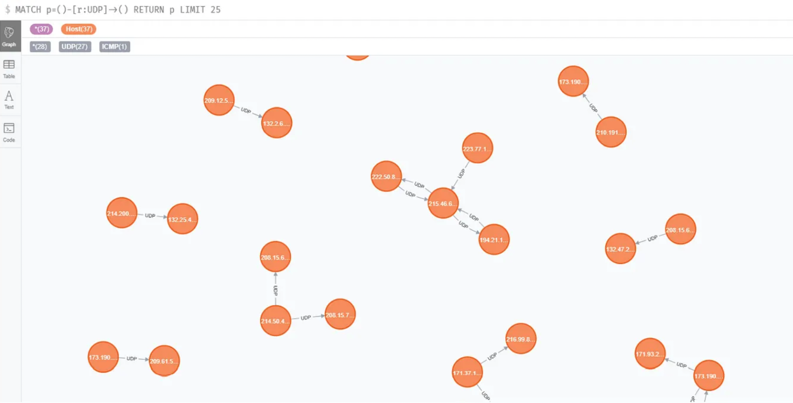
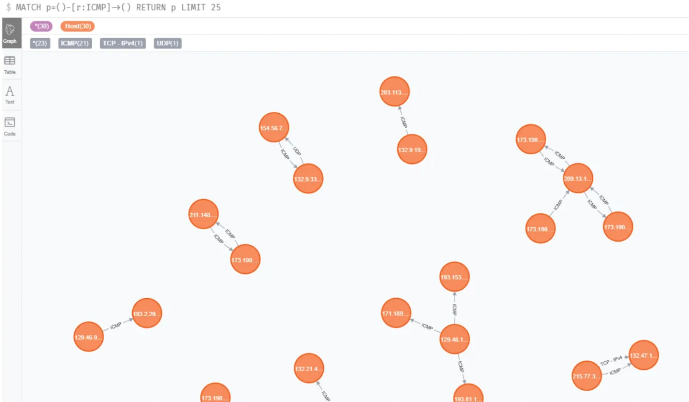
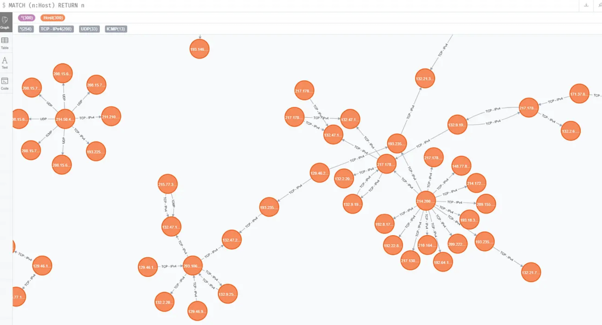

# Network-Communication-Visualization

This repository contains the source code as well as the visualisations created as a part of a project for the Computer Networks course at PES University.

This project aims to build a data pipeline that:

- Processes network trace data,
- Models communication between devices (senders and receivers) as a graph in Neo4j,
- Establishes relationships between these devices based on the protocols used (e.g., TCP, UDP, ARP, ICMP),
- Enables the visualization and analysis of network traffic to gain insights into network behavior and performance.

## Implementation and Results

Python is chosen as the primary tool to build the data pipeline due to its extensive libraries for handling data (such as pandas for data manipulation), network trace analysis (e.g., scapy for parsing packet data), and graph database interaction (such as py2neo or neo4j-driver for connecting to Neo4j). 
The code is written in the Jupyter Notebook and the results can be visualized in Neo4j using Cypher SQL. 

Visualization of UDP nodes and relationships 

`MATCH p = ( ) — [ r:UDP] => ( ) RETURN p LIMIT 25`

Visualization of ICMP nodes and relationships 

`MATCH p = ( ) — [ r:ICMP] => ( ) RETURN p LIMIT 25`

Visualization of the database 

`MATCH (n:HOST) RETURN n`

## Network Trace Data Processing
Network traces represent communication data between various devices in a network, typically capturing protocols such as TCP, UDP, ARP, and ICMP. These traces record details of data packets being transmitted and received by devices. Each trace contains valuable information about:

- Sender (Source): The device sending the data packet.
- Receiver (Destination): The device receiving the data packet.
- Protocol: The communication protocol used, such as TCP (Transmission Control Protocol), UDP (User Datagram Protocol), ARP (Address Resolution Protocol), or ICMP (Internet Control Message Protocol).
  
By processing these network traces, the project aims to model the interactions between network nodes (senders and receivers) and the protocols they use.

## Graph Database (Neo4j)
Neo4j is a graph database that is well-suited for modeling relationships between entities. In the context of this project:

- Nodes: Each sender and receiver in the network is represented as a "Node" in the graph.
- Relationships: The protocol (e.g., TCP, UDP, ARP, ICMP) used in communication between nodes is represented as a "Relationship" between these nodes.
  
This graph-based representation makes it easier to visualize and analyze network communication patterns by seeing how different devices interact and what protocols they use.

## Visualization and Analysis

The ultimate goal of the project is to enable the visualization of network traffic using a graph model. This has several benefits:

- Network Analysis: Visualizing sender-receiver relationships allows for easy detection of communication patterns, bottlenecks, and anomalies in the network.
- Protocol Insights: Understanding which protocols are being used between which devices can help network administrators optimize performance and detect malicious activity (e.g., unauthorized ARP requests or suspicious ICMP traffic).
- Troubleshooting: A graph representation of network interactions can help troubleshoot connectivity issues, identify problematic nodes, and ensure the network is functioning as intended.

